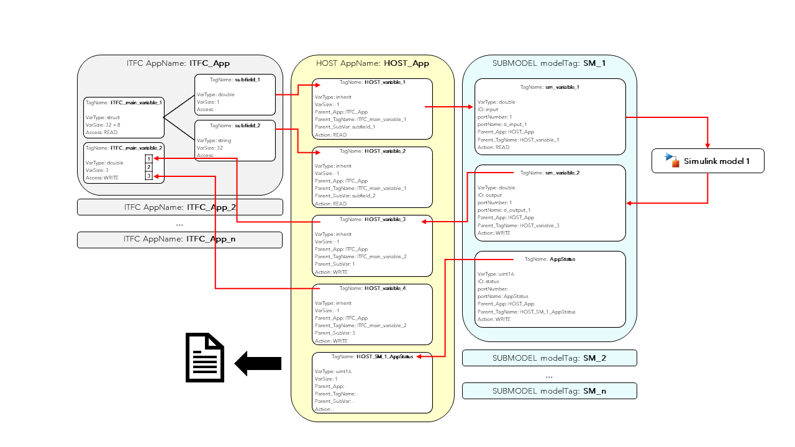
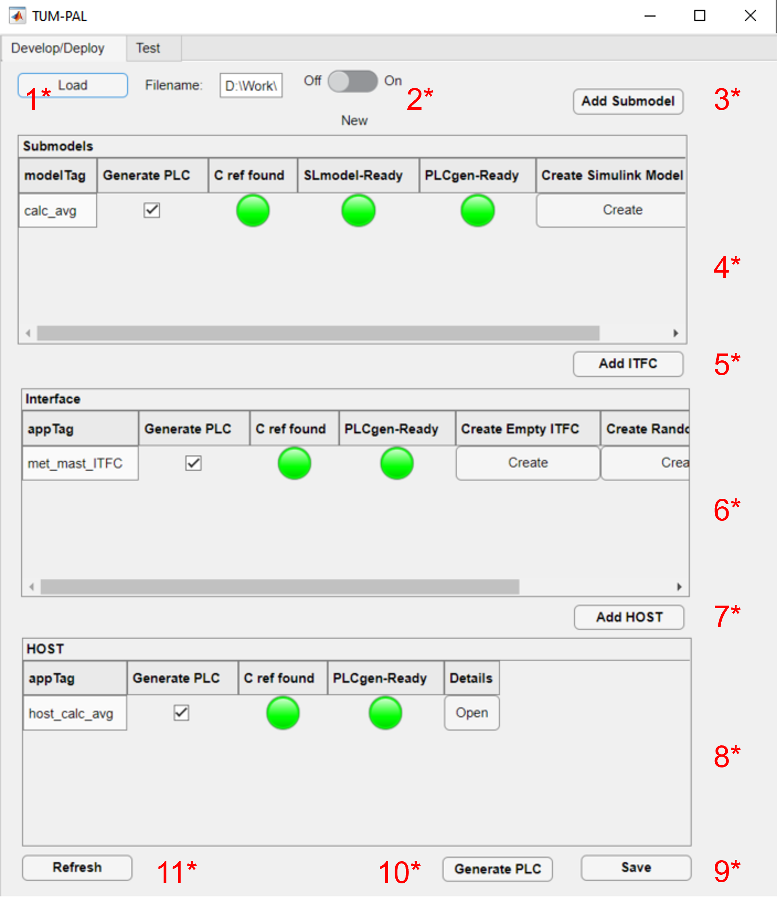
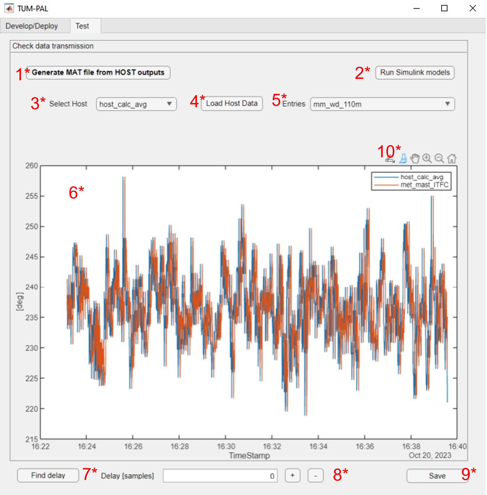

User Guide
===========

.. contents::

General Framework Architecture
------------------------------

The framework adopts a structured three-layer approach. Each layer consists of specific applications, each designed to serve a distinct purpose:

**ITFC (Interface):**
This is the lowest-level application responsible for tasks such as sensor reading and providing input to actuators, effectively connecting to the physical layer. Ideally, ITFC apps can be developed by the owner of the hardware. Every project must include at least one ITFC app, though the use of multiple ITFC apps is permitted. ITFC applications share variables through a shared variable interface (SVI), and these can be read from and written to by a HOST app.

**HOST:**
This application operates in the middle layer and is responsible for tasks like data reading and writing to and from ITFC applications. HOST also manages variables crucial for experiment execution, monitoring, and communication between SUBMODEL applications. It generates output files in text format. Please note that as of October 2023, each project supports only one HOST application. Data sharing is performed through a shared variable interface (SVI), allowing read and write access by SUBMODEL apps.

**SUBMODEL:**
This is the top layer, comprising the primary application models based on Simulink models. Simulink inputs and outputs are connected to HOST SVIs. Any number of SUBMODELS can be implemented within a project.

One sampling frequency must be specified for the execution of the whole framework. As of Release 1.0, different frequency execution for different applications is not supported. An exemplary sketch of the framework data flow is shown in figure [INSERT FIGURE].

Empty C Source projects should be generated for each PLC application through Bachmann SolutionCenter. These source codes are then automatically modified by the framework to incorporate all the necessary variable interconnections required by the different applications.

The framework is equipped with a Graphic User Interface (GUI) that simplifies the development process and which is divided into Develop/Deploy (Section XX) and Test (Section XX).

Project Definition
-----------------------

When creating a new project through the GUI (Section XX), two excel files are created by default: “inputfile.xlsx” and “SVI_definition.xlsx”. Those files define each project and are used to define the application layers described above, as well as the data exchange between each application.

Inputfile.xlsx
^^^^^^^^^^^^^^^^^^^^

This file contains general information for the project, such as folder definitions,  settings and layers applications.
The main tabs are described below.

**Main Folders** 

This tab defines the location of subfolders necessary for each project. This sheet is automatically generated upon creation of a new project. A description of each table entry is provided here:

.. csv-table:: Inputfile - Main Folders sheet
   :file: inputfile_description_mainfolders.csv
   :widths: 30, 30, 40
   :header-rows: 1

**Settings** 

This tab defines some main settings of the project execution and compilation. Important parameters, such as sample time execution and PLC System must be specified here, as well as the location of the "SVI_Definition.xlsx file"

.. csv-table:: Inputfile - Settings sheet
   :file: inputfile_settings.csv
   :widths: 30, 30, 40
   :header-rows: 1

ITFC
"""""""""

One row for each ITFC application. Each can take as input a test interface in the form of .mat file. Multiple ITFC Apps are supported. 

.. csv-table:: Inputfile - ITFC sheet
   :file: inputfile_itfc.csv
   :widths: 30, 30, 40
   :header-rows: 1

HOST
"""""""""

One row for each HOST application. IMPORTANT: only one HOST application can be used for each project. 

.. csv-table:: Inputfile - HOST sheet
   :file: inputfile_host.csv
   :widths: 30, 30, 40
   :header-rows: 1

SUBMODELS
"""""""""

One row for each Simulink submodel. IMPORTANT: each submodel can have a single Simulink model associated. There is no limit to the number of SUBMODELS for each project. 

.. csv-table::  Inputfile - SUBMODELS sheet
   :file: inputfile_submodel.csv
   :widths: 30, 30, 40
   :header-rows: 1

SVI_Definition.xlsx
^^^^^^^^^^^^^^^^^^^^

This excel file defined the data flow between the different layers of each project. Variables for each application must be specified, as well as data trasmission to other applications. 

Generally speaking, each application hosts a "shared variable interface" (SVI), which can be read and written by other applications. There are three sheets in the SVI_Definition file, one for each layer of the framework (ITFC, HOST, Submodel). Allowed variables data types are common for each layer and can be found **here**. Exceptions exist for ITFC variables, as specified below.

ITFC
"""""""""

To promote separation between hardware-specific and research-specific operations, this layer should be ideally developed by the hardware owner. This layer is used uniquely for testing purposes, to ensure that the remaining framework components (mainly the simulink submodels) operate as expected. For this reason it is fundamental that the SVI of the ITFC applications exactly replicates the one encountered during experimentation. 

ITFC applications are "inert", in the sense that they do not actively perform any reading or writing operation on any other application's SVI. HOST applications can read and write information to ITFC SVI's. 

**ITFC Variables** 

Beside the already mentioned **data type** , ITFC variables in the form of structures can also be implemented. In this case all subfields will share the same "Access" property. Numerical arrays are not yet supported for subfields, with the exception of string arrays. A description of all the table elements is provided below.

.. csv-table::  SVI_Definition - ITFC sheet
   :file: svi_definition_itfc.csv
   :widths: 30, 30, 40
   :header-rows: 1

HOST
"""""""""

HOST variables can perform READ/WRITE actions to a ITFC variable, while they cannot perform actions on SUBMODEL.

**HOST Variables** 

HOST Variables can be created for many purposes, such as:
   (1) Read variable from ITFC to be read by SUBMODEL
   (2) Read variable from ITFC for monitoring purposes
   (3) Create static variables to be read by SUBMODEL, useful for consant definition
   (4) Receive output from SUBMODEL and write it to ITFC
   (5) Receive output from SUBMODEL for monitoring purposes
   (6) Receive AppStatus variable from SUBMODEL, to check operation of application

Beside string variables, all HOST variables **MUST** be a single numerical value, i.e, arrays are not allowed.
It is important that, in case of variables exchanged with an ITFC app, the "Action" of a HOST Variable matches the "Access" of a ITFC Variable. By default, HOST applications generate three txt outputs at three different sampling time: "fast", "slow", "ctrl". For each HOST variable, this can be controlled by the field "output_freq".

.. csv-table::  SVI_Definition - HOST sheet
   :file: svi_definition_host.csv
   :widths: 30, 30, 40
   :header-rows: 1

SUBMODEL
"""""""""

SUBMODEL variables can perform READ/WRITE actions to a HOST variable, while they cannot perform actions on SUBMODEL. For each Simulink model, it is reccommended to include **all** model inputs and outputs as SUBMODEL variables (with the correct port numbering). For each SUBMODEL application, a further **AppStatus** status variable should be included, which is used to inform the HOST application about the execution of the SUBMODEL.

**SUBMODEL Variables** 

Also SUBMODEL variables must be single numerical values, i.e, arrays are not allowed. The "IO" type field must match the type of port of Simulink model, except for "status" variables. Generally, each SUBMODEL will contain nI + nO + 1 variables, where nI/nO indicates the number of input/output ports of a Simulink model. 

.. csv-table::  SVI_Definition - SUBMODELS sheet
   :file: svi_definition_submodels.csv
   :widths: 30, 30, 40
   :header-rows: 1

Below in :numref:`sketch_data_trasmission`, an exemplary sketch that illustrates the data transmission of two ITFC variables (a structure and an array), which are exchanged with a Simulink model

   Example of data transmission between ITFC/HOST/SUBMODEL layers

Graphic User Interface
-----------------------

To start a new session, open the App Designer file “main.mlapp” and run it. A new GUI will open. There are two main tabs that are devoted to two specific operations of the framework: the “Develop/Deploy” and the “test” tab. 

Develop/Deploy
^^^^^^^^^^^^^^^^^^^

Through the Develop/Deploy tab it is possible to define the main applications for each layer. A sketch of the GUI for the example project "met_mast_reader" is shown in :numref:`paldd`

   Develop/Deploy Tab

And explained in the following table.

.. csv-table::  GUI - overview Develop/Deploy tab
   :file: gui_guide_dd.csv
   :widths: 30, 30, 40
   :header-rows: 1

New applications can be generated for each layer through the respective buttons. 
Application panels are described for each layer.

SUBMODEL
"""""""""
Aften generating a new SUBMODEL, several options and flags will be visible

.. csv-table::  GUI - SUBMODEL panel
   :file: sm_gui.csv
   :widths: 30, 70
   :header-rows: 1

It is important to remark that if an user wants to use a Simulink model developed externally, it is better to copy-paste its content into a newly created one, thus keeping the Simulink model settings set through the button "Create Simulink Model". This will create, beside an empty Simulink model, an initialization .m file that can be used to initialize specific model parameters.

ITFC
"""""""""
.. csv-table::  GUI - ITFC panel
   :file: ITFC_gui.csv
   :widths: 30, 70
   :header-rows: 1

HOST
"""""""""
Same as SUBMODEL panel.

Test
^^^^^^^^^^^^^^^^^^^

After generating the PLC applications it it possible to run the framework on the PLC hardware. The host application will generate .txt outputs, which can be used to verify the correctness of the data transmission between the different applications. The Test tab provides a tool to read HOST outputs and to compare the results between PLC and Simulink, among other functions. It is important to notice that the applications should be loaded on the PLC in sequential order from lower to higher layer, i.e. ITFC, HOST, SUBMODEL. For this reason a residual delay will exist between the test ITFC data and the HOST data, which is of course not physical but purely introduced by this delay. 

A sketch of the GUI for the example project "met_mast_reader" is shown in :numref:`paltest`

   Test tab

.. csv-table::  GUI - overview Test tab
   :file: gui_guide_test.csv
   :widths: 30, 30, 40
   :header-rows: 1

Before running the Simulink models, unphysical data should be trimmed by using the Brush function, together with the "Brush Data/ sync ITFC app" (right-click on the figure). The user should familiarize with the testing functionality by following the **examples**

Examples
-----------------------

The following subsections describe two examples derives from wind energy applications: a met-mast data reader, which can be used to read data from from a met-mast and to perform moving averages for monitoring purposes, and a SCADA-data reader.

Example 1: Met-Mast data reader
^^^^^^^^^^^^^^^^^^^^^^^^^^^^^^^^^^

In this first example, we are going to create a simple framework to read data from a met-mast ITFC app, calculate moving averages and some additional inflow quantities, which are written back to the ITFC.

The first step is to open the framework by double-clicking on the main file. This opens a GUI. There will be two options for us to choose: load an existing file or create a new one. we click on "new,"a window will appear where we can specify the folder for our new project. We open the folder in which we want to create the new model and click ok.

Then, we need to specify the new project name. We'll call it " met_mast_reader" and click OK. This will create a set of subfolders, as explained in sectionXX

Now, we have three main panels, each linked to a specific application type. We must create at least three applications:
1.	ITFC for data transmission and testing.
2.	The host, responsible for managing output data.
3.	A Simulink model performing the averaging function.

**Create a new submodel**

1.	Let us start by creating a Simulink model. Click on "Add Simulink model" and provide the name, such as "calc_avg". This model takes inputs from wind speed and wind direction data to calculate averages based on the desired window size. Click OK. You'll notice a new model appears in the first row of the relative panel, which is affected indicated by several red lights. 
2.	A new model will appear in the relative panel's first row with several red indicator lights. First, create an empty Simulink model by clicking "Create" in the "Create Simulink Model" column. This generates the model in the specified folder and an "init_MODELTAG.m" file used for initializing data and constants. The green light indicates the model's presence in the Matlab path.
3.	Next, create a new Bachman Empty project within Solution Center as detailed in the "CREATE BACHMANN APP" section. Ensure the main app file is copied into the reference C folder, located at "ProjectName\ReferenceCfiles\Originals." If the file name was changed, update it by clicking "Details" and altering "refC_name" to the new name (“calavg” in the present case) The green "C ref found" light signifies that it can locate the reference file.
4.	Right-click on the "C ref found" light and select "Add Matlab Fields.". This allows the framework to later modify this file.
5.	To create your Simulink model, you can either modify the empty one, copy and paste into the existing model, or use the example provided. If you plan to use a custom Simulink model, note that some settings may differ, so it's advisable to copy the content of your model into the newly created one.

6.	Open the model provided. The model has three main inputs: 
a.	Met mast wind speed at 110m
b.	Met mast wind speed at 60m
c.	Met mast wind direction at 110m. 

7.	The reference heights in this example are based on the IEA Task 39. The application checks if variables are broken (e.g., frozen) and then calculates moving averages. Several outputs are computed:
a.	Moving average of the wind speed at 110m
b.	Turbulence intensity
c.	Moving average of the wind speed at 60m
d.	Shear exponent
e.	Moving average of the wind direction at 110m
f.	Status check to monitor runtime activity
8.	The model requires specific quantities defined, which you can inspect by opening the relevant “init_calc_avg.m”file. Quantities like startup time, moving average interval, and error time are here set to 600, ensuring averages are calculated over a 10-minute period.
9.	With these settings in place, your Simulink model is ready to use.

**Create a new ITFC**

1.	Create a new ITFC app by clicking the "Add ITFC" button and name it "met_mast_ITFC"
2.	As done for the Submodel app, Create a new Bachman Empty project within Solution Center, following the guidance in the "CREATE BACHMANN APP" section. Copy and paste the reference app file into the "Originals" folder. If needed, rename it. Then, right-click on "C ref found" and select "Add MATLAB fields"

**Create a new HOST**

1.	Follow the same procedure described above. Name the host application "host_calc_avg."
2.	Complete all required fields using the "Details" button. For detailed guidance, refer to the specified section. Name the application "hcalc."
3.	Add the necessary Matlab fields. The "PLCgen-Ready" indicator turns green. Note that no variables have been added yet, so there's no need for additional action at this stage.
4.	Specify "out_filename" as "hcalc_outputs" and provide the "output_path_in_PLC" (note that this may vary on your PLC). Ensure the corresponding folder is pre-created on the PLC; otherwise, the entire framework will crash on startup.
5.	At this point, the basic applications have been created. Don't forget to save your progress by clicking the “Save” button below. This will write the excel file “inputfile.xlsx”

**Modify the main inputfile**

The main structure of the input file is detailed in Section XX (add this link), which is not discussed here. There are three tabs, and these submodules interface with the host. Any changes made to the “Submodels”, “ITFC” and “HOST” tabs will be reflected in the application the next time it's loaded.

Click on the "Settings" tab, and adjust the parameter "sample_time" to the desired value. All framework applications will run at this frequency. In the present case 0.1 seconds. As already mentioned, only Bachmann systems can be selected in the "PLC_system" column.
Next, navigate to the "Submodels" tab. Here, you'll find a "host_app_tag" column, which indicates the host application with which the submodel application exchanges data. Currently, only one host application should be used for each Submodel. Copy the "appTag" from the desired host and paste it here. Once done, you can close the file.

**Modify the “SVI_Definition”**

One of the key files to generate is the "SVI definition.xlsx." This file is crucial as it enables us to define and establish the interconnections among various variables across different applications. Much like the "inputfile," the "SVI definition.xlsx" comprises three tabs: interface, host, and submodels.

**ITFC**

The initial step is to define the interface variables. In a real-world scenario, this application would collect data from physical hardware. However, in this case, we will create a dummy interface to emulate real-world conditions, allowing us to test data transmission among all the other applications seamlessly.
We want to define two variables: one is a structure, which will contain the met mast variables to be read by the host. The second is a vector that will contain all variables to be written back. 
•	To begin, create a variable named 'met_mast' and provide the 'TagName' and 'VarName' details. Set 'InputNumber' to 1 and verify that 'AppName' matches the entry in 'inputfile.xlsx.' Specify 'VarType' as 'struct,' choose 'READ' for the 'Access' field, and ensure 'Create' is set to 1. It's worth noting that structures can handle variables of different data types. The 'VarSize' field is used to specify the size in bytes of the structure's content, which may vary based on the data types included. For now, it can be left empty.
•	Now define three subvariables under "met_mast." These subvariables are: "Wind Speed at 110 Meters (ws_110m)," "Wind Speed at 60 Meters (ws_60m)," and "Wind Direction at 110 Meters (wd_110m)." Ensure that the 'InputNumber' for each subvariable matches the structure, leave 'AppName' empty, specify 'VarType' as "double," set 'VarSize' to 1, choose 'Access' as 1, and mark 'Create' as 1 for each of these subvariables.
•	Now, we establish an additional variable known as 'exchange_data_mm' for the purpose of storing and writing the some output values from the host to the interface. 'InputNumber' must be 2 (since it is a separate variable), 'VarType'is double, 'VarSize' is 5, access is WRITE.

The resulting sheet can be viewed in the following **figure [Insert Figure Reference].**

**HOST**

•	At first, create three variables that correspond to the inputs of your Simulink model. These variables must be read from the interface structure, therefore "Parent App," "Parent Tag Name," and "Parent SubVar" must be defined. Set "Action" to "READ" and set the "output_freq" as "fast" for these input variables.
•	Afterward, we specify the outputs of our Simulink model, which consist of six variables. Out of these six variables, five are exchanged with the interface, so we must provide information in the "parent_App," "parent_TagName," and "parent_SubVar" fields for these. The last variable, "avg_inflow State," will not be written back to the interface. For the average quantities, we define "output_freq" as "slow", while for the “avg_inflowState”, we print it at “ctrl” frequency.
•	It is mandatory to include an “AppStatus” variable for each submodel included in the framework. Since here we have a single submodel named “calc_avg”, the variable “avg_inflow_AppStatus” is added. the type of this quantity can be a 16 bit unsigned integer. This variable is outputted at “ctrl” frequency.

**Submodels**

All the input and outputs of the submodel “calc_avg” need to be included. For a detailed explanation of the various input fields, please read [insert reference]. 
Three types of variables have been defined. The first three are the inputs for our Simulink model, and they are marked as "input" in the "I/O" field. Since these variables need to be read by the host application, we must specify the "parent_App" and "parent_TagName" fields. Additionally, ensure that the "Action" is set as "READ”.
Further six variables represent the outputs of the Simulink model. It's crucial to correctly define the “PortNumber” of both inputs and outputs variables correctly based on the port numbering of the Simulink model. Also, the “PortName” should match those in the Simulink model. Similarly, the "parent_App" and "parent_TagName" fields need to be specified. In this case, the "Action" should be set to "WRITE."
For each submodel, an "AppStatus" variable is required, indicated by the "IO" field set as "status." This variable doesn't require a port number, and the port name should be set as "AppStatus." This variable should be set to "write." Now we can save the “SVI_Definition” file.

**Generate the test interface**
An error will occur, saying:
ITFC App "met_mast_ITFC" - variable "met_mast" is a struct of size NaN Bytes, but its subvariables sum up to 24. Please check the excel file.
This is caused by the fact that we left empty the “VarSize” field of the ITFC variable “met_mast”. 
, which is caused by the fact that we have not specified the ”
ADD TO THE FRAMEWORK AUTOMATIC SUMMATION

Now, it's time to load the model and test it. To perform the testing, we'll need to create a dummy interface. Here are the steps to follow:
Open your "inputfile.xlsx," and in the "ITFC" sheet, fill in the "test_ITFC_filename" for your ITFC model, including any relative path. Let's create this file in "./Examples/met_mast_reader/mm_ITFC.mat."
Click now on the button "Create Random ITFC." This action will prompt you to specify the duration of the time histories. The default value is 100 seconds. Keep in mind that if it's too long, it might pose storage issues on your PLC. However, in this case, since we have only a few variables, it shouldn't be a problem. Let's set it to 1000 seconds and click "OK."
You'll notice that a new "mm_ITFC.mat" file has been generated. If you open it, you'll find the "met_mast" structure and the "exchange_data_mm" array. Initially, these variables will be populated with random data according to their data type. However, this will not be realistic for wind speed and direction data. You have two options: either replace the random data with your own or use the provided dummy variables containing realistic data. By default, only the read variables will be filled with random numbers, while the others will be set to 0.
To load the interface, you need to open the details of your ITFC_App and set its "Flag_Create_test_ITFC" to TRUE.

**Generate the PLC code**

Now, it is time to generate the PLC Applications.
Ensure that all the "Generate PLC" boxes within your application are checked.
Save your project to retaub all recent changes.
Subsequently, click on the "Generate PLC" button situated at the bottom of the GUI.
Consequently, three folders will be created under the directory labeled "PLCApps." To conclude this process, you should transfer the contents of each of these folders into the corresponding applications folder within your PLC path.

**Testing the framework**

The applications can be now run through the Bachmann Solution Center. It is important to run the different applications in a specific order: start with the ITFC, proceed to HOST, and conclude with the submodel.
Within the HOST applications, a variable called "Flag_Record" is created. You can use it to control the generation of output files.
Wait for the test to complete, which will take 1000 seconds. Once it's done, copy the output files back to the Matlab folder.
In the GUI "Test" tab, generate a ".mat" file that aggregates your outputs by clicking "Generate MAT file from HOST outputs." Select all the outputs (FAST, SLOW, and CTRL). This will create a file named "hcalc_outputs.mat."
Choose the host application you wish to check and load the HOST data using the ".mat" file you just created. All the host variables will be visible in the dropdown menu.

Select a variable, such as "mm_ws_110m." You will see two curves, one from the ITFC data and the other from the output of the HOST application. Through this step we can verify whether the two signals are identical.
If discrepancies are observed in the HOST data, it may indicate data transmission errors. In our case, we've observed that the HOST's time history is affected by these issues, primarily due to recording data after the ITFC time history has ended, leading to the transmission of random data.
To rectify this, use the "Brush Data" feature to select the data you wish to retain. Right-click, and choose "Brush Data / Sync ITFC App" to ensure both signals match. They might still have a time shift because the ITFC application began earlier than the HOST application.
To fix this time shift, click "Find delay" and manually adjust the ITFC signal using the "+” and “-” buttons. Once synchronization is achieved, select the data to keep and employ the "Brush Data / Sync ITFC App" function once more. This will synchronize all variables originating from the same ITFC application, eliminating the need to do it individually for HOST variables. This synchronization process extends to other variables like “mm_ws_60m” and “mm_wd_110m” read from the interface.
When we choose "avg_ws_110m," we notice that we can only see the host results. Our goal is now to confirm that the Simulink models work the same way in both the PLC and Matlab. To do this, we run the Simulink model by clicking "Run Simulink models," using the same inputs as the host application. This helps us compare and make sure the C model is working correctly.
The comparison should align well after the initial ramp-up time required for the moving average.
Verify the last two variables, "avg_inflow_AppStatus," which should be 0 when the submodel "calc_avg" was not running and 1 otherwise, and "avg_inflowState," which should be 0 when the submodel is running correctly and a number between 1 and 7 otherwise.
Save your results by clicking on "Save" with the desired output file name to generate a ".mat" file for future reference.
This concludes the tutorial. Your applications are now ready for execution.
