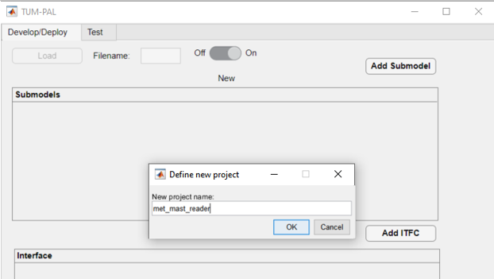

User Guide
===========

.. contents::

General Framework Architecture
------------------------------

The framework adopts a structured three-layer approach. Each layer consists of specific applications, each designed to serve a distinct purpose:

**ITFC (Interface):**
This is the lowest-level application responsible for tasks such as sensor reading and providing input to actuators, effectively connecting to the physical layer. Ideally, ITFC apps can be developed by the owner of the hardware. Every project must include at least one ITFC app, though the use of multiple ITFC apps is permitted. ITFC applications share variables through a shared variable interface (SVI), and these can be read from and written to by a HOST app.

**HOST:**
This application operates in the middle layer and is responsible for tasks like data reading and writing to and from ITFC applications. HOST also manages variables crucial for experiment execution, monitoring, and communication between SUBMODEL applications. It generates output files in text format. Please note that as of October 2023, each project supports only one HOST application. Data sharing is performed through a shared variable interface (SVI), allowing read and write access by SUBMODEL apps.

**SUBMODEL:**
This is the top layer, comprising the primary application models based on Simulink models. Simulink inputs and outputs are connected to HOST SVIs. Any number of SUBMODELS can be implemented within a project.

One sampling frequency must be specified for the execution of the whole framework. As of Release 1.0, different frequency execution for different applications is not supported. An exemplary sketch of the framework data flow is shown in figure [INSERT FIGURE].

Empty C Source projects should be generated for each PLC application through Bachmann SolutionCenter. These source codes are then automatically modified by the framework to incorporate all the necessary variable interconnections required by the different applications.

The framework is equipped with a Graphic User Interface (GUI) that simplifies the development process and which is divided into Develop/Deploy (Section XX) and Test (Section XX).

.. _user_guide_project_definition:

Project Definition 
-----------------------

When creating a new project through the GUI (Section XX), a folder with the name of the project is created. Additionally, two default folders created, namely a "ReferenceCFiles" and a "SimulinkModels" folders, which are used to store the reference PLC source code and the Simulink models necessary for the SUBMODELs. 
Additionally, two excel files are created: “inputfile.xlsx” and “SVI_definition.xlsx”. Those files define each project and are used to define the application layers described above, as well as the data exchange between each application.

Inputfile.xlsx
^^^^^^^^^^^^^^^^^^^^

.. include:: inputfile.inc

SVI_Definition.xlsx
^^^^^^^^^^^^^^^^^^^^

.. include:: svi_definition.inc

Graphic User Interface
-----------------------

.. include:: gui_guide.inc

Examples
-----------------------

The following subsections describe two examples derives from wind energy applications: a met-mast data reader, which can be used to read data from from a met-mast and to perform moving averages for monitoring purposes, and a SCADA-data reader.

Example 1: Met-Mast data reader
^^^^^^^^^^^^^^^^^^^^^^^^^^^^^^^^^^

In this first example, we are going to create a simple framework to read data from a met-mast ITFC app, calculate moving averages and some additional inflow quantities, which are written back to the ITFC.

The first step is to open the framework by double-clicking on the main file "mail.mlapp". This opens the main GUI. There will be two options for us to choose: load an existing file or create a new one. We click on "new". A window will appear where we can specify the folder for our new project. We open the "Examples" folder and click OK.

Then, we need to specify the new project name. We'll call it "met_mast_reader" and click OK (:numref:`mmr_new`). This will create a set of subfolders, as explained in :ref:`Project Definition<user_guide_project_definition>`.

   Define new project view

We must create at least three applications, one for each data layer:

   (1) A Simulink model performing the averaging function, together with its SUBMODEL
   (2) An ITFC for data transmission and testing
   (3) An HOST, responsible for managing output data

Create a new SUBMODEL
"""""""""""""""""""""""""""

   #. Let us start by creating a Simulink model. Click on "Add SUBMODEL" and provide the name, such as "calc_avg". Click OK. This model takes inputs from wind speed and wind direction data to calculate averages based on the desired window size. A new model will appear in the relative panel's first row with several red indicator lights (:numref:`mmr_new2`).  

   .. figure:: images/mmr_new2.png
      :width: 1000
      :name: mmr_new2

      Overview of newly created "calc_avg"  

   #. Create an empty Simulink model by clicking "Create" in the "Create Simulink Model" column. This generates the Simulink model in the model folder and an "init_MODELTAG.m" file which can be used for initializing data and constants. A green light under "SLmodel-Ready" indicates the model's presence in the Matlab path.

   #. Next, create a new Bachman Empty project within Solution Center as detailed in the :ref:`Create Bachmann Applications <user_guide_appendix_createbachmann>` section. Ensure the main application source file is copied into the reference C folder, located in "ProjectName\\ReferenceCfiles\\Originals". If the source file name was changed, update it by clicking "Details" and altering "refC_name" to the new name (“calavg” in the present case) The green "C ref found" light indicates that the reference C file was found by the framework.

   #. Right-click on the "C ref found" light and select "Add Matlab Fields" (:numref:`mmr_new3`). This modified the reference files enabling variables interconnection.

      .. figure:: images/mmr_new3.png
         :width: 1000
         :name: mmr_new3

         Add Matlab Fields for the SUBMODEL "calc_avg" 

   #. Create the Simulink model in the appropriate folder. You can either modify the empty one, copy and paste into the existing model, or use the example provided under "Examples\\met_mast_reader_sample\\SimulinkModels\\calc_avg". If you plan to use a custom Simulink model, note that some settings may differ, so it's advisable to copy the content of your model into the newly created one. As already mentioned.

   #. Open the model provided. The model has three main inputs: 

       #.	Met mast wind speed at 110m
       #.	Met mast wind speed at 60m
       #.	Met mast wind direction at 110m. 

      The reference heights in this example are based on the IEA Task 39 reference wind turbine (INSERT REFERENCE). The model checks if variables are broken (e.g. frozen) and then calculates moving averages. Several outputs are computed:

       #.	Moving average of the wind speed at 110m
       #.	Turbulence intensity
       #.	Moving average of the wind speed at 60m
       #.	Shear exponent
       #.	Moving average of the wind direction at 110m
       #.	Status check to monitor runtime activity

   #. The model requires specific quantities defined, which you can inspect by opening the relevant “init_calc_avg.m”file. Quantities like startup time, moving average interval, and error time are here set to 600 s.
   #. With these settings in place, your Simulink model is ready to use.

Create a new ITFC
""""""""""""""""""""""""""""""""

   #. Create a new ITFC app by clicking the "Add ITFC" button and name it "met_mast_ITFC"
   #. As done for "calc_avg", create a new empty PLC code following :ref:`Create Bachmann Applications<user_guide_appendix_createbachmann>`. Name the source application "mmitfc". Copy and paste the reference app file into the "Originals" folder and update the app "Details".
   #.  Right-click on the "C ref found" light and select "Add Matlab Fields" 

Create a new HOST
""""""""""""""""""""""""""""""""

   #.  Create a new HOST app by clicking the "Add HOST" button and name it "met_mast_ITFC"
   #.  Complete all required fields using the "Details" button, following the guidance provided in the :ref:`inputfile definition <user_guide_inputfile_host>` section
   #.  Create a new empty PLC code following :ref:`Create Bachmann Applications<user_guide_appendix_createbachmann>`. Name the source  application "hcalc". Copy and paste the reference app file into the "Originals" folder and update the app "Details"
   #.  Add the necessary Matlab fields. The "PLCgen-Ready" indicator turns green. 
   #.  Specify "out_filename" field in "Details" as "hcalc_outputs" and provide the "output_path_in_PLC" (note that this may vary on your PLC). Ensure the corresponding folder is pre-created on the PLC; otherwise, the entire framework will crash on startup
   #.  At this point, the basic applications have been created. Don't forget to save your progress by clicking the “Save” button below. This will write the excel file “inputfile.xlsx”

Modify the "inputfile.xlsx"
""""""""""""""""""""""""""""""""

Open the "inputfile.xlsx". Any changes made to the “Submodels”, “ITFC” and “HOST” tabs will be reflected in the application the next time it's loaded.

Click on the "Settings" tab, and adjust the parameter "sample_time" to the desired value. In this case 0.1 seconds is chosen. All framework applications will run at this frequency. As already mentioned, only Bachmann systems can be selected in the "PLC_system" column.

Next, navigate to the "Submodels" tab. In the "host_apptag" column of "calc_avg", specify "host_calc_avg". This indicates the host application which the submodel application exchanges data with. As already said, only one host application should be used for every SUBMODEL. Save and close the file.

Below an overview of the different tabs in "inputfile.xlsx"

.. csv-table::  met_mast_reader - "inputfile.xlsx" - SUBMODEL
   :file: inputfile_met_mast_reader_1.csv
   :header-rows: 1

.. csv-table::  met_mast_reader - "inputfile.xlsx" - ITFC
   :file: inputfile_met_mast_reader_2.csv
   :header-rows: 1

.. csv-table::  met_mast_reader - "inputfile.xlsx" - HOST
   :file: inputfile_met_mast_reader_3.csv
   :header-rows: 1

.. csv-table::  met_mast_reader - "inputfile.xlsx" - Settings
   :file: inputfile_met_mast_reader_4.csv
   :widths: 30, 60, 10
   :header-rows: 1

Modify the “SVI_Definition”
""""""""""""""""""""""""""""""""

In this step we will define the variables for each application and the relative variable interconnections between different layers. Open the "SVI definition.xlsx." The definitions relative to each layer is specified in the following sections.

**ITFC**

We want now to create a dummy interface to emulate real-world conditions. For the present met-mast case, we want to define two variables: one is a structure which will contain the met-mast variables to be read by the HOST "host_calc_avg". The second is a vector of double, which contains all variables that the HOST will write back to the ITFC. 

   #. Create the structure: set both "TagName" and "VarName" as "met_mast". Set 'InputNumber' to 1 and verify that "AppName" matches the HOST app in "inputfile.xlsx." Specify "VarType" as "struct," type "READ" in the "Access" field, and ensure "Create" is set to true. It's worth reminding that structures can handle variables of different data types. The "VarSize" field is used to specify the size in bytes of the structure's content, which may vary based on the data types included. For now, it can be left empty

   #. Define three subvariables under "met_mast." These subvariables are: 
       #. Wind Speed at 110 Meters, named "ws_110m"
       #. Wind Speed at 60 Meters, named "ws_60m"
       #. Wind Direction at 110 Meters, named "wd_110m"
      
      Ensure that the "InputNumber" for each subvariable matches that of the structure, leave "AppName" empty, specify "VarType" as "double," set "VarSize" to 1, and mark "Create" as true for each of these subvariables. "Access" can be left empty, since it will be inherited from the structure
   #. Create a variable named "exchange_data_mm" for the purpose of storing and writing output values from the HOST to the ITFC. "InputNumber" must be 2, set "VarType" to double and "VarSize" to 5. Set "Access" to WRITE

The resulting sheet can be viewed in the following :ref:`table<SVI_Definition_itfc_mmreader>`.

.. csv-table::  met_mast_reader - "SVI_Definition.xlsx" - ITFC
   :file: SVI_Definition_itfc_mmreader.csv
   :header-rows: 1
   :name: SVI_Definition_itfc_mmreader

**HOST**

The "host_calc_avg" app contains 10 variables, as shown in the :ref:`table<SVI_Definition_itfc_mmreader>`: 

   #. Create three variables that correspond to the inputs of your Simulink model. These variables must be read from the interface structure, therefore "parent_App," "parent_TagName,      " and "parent_SubVar" must be defined. Set "Action" to "READ" and set the "output_freq" as "fast" for these input variables.
   #. Specify the outputs of our Simulink model, which consist of six variables. Out of these six variables, five are exchanged with the interface, so we must provide information in       the "parent_App," "parent_TagName," and "parent_SubVar" fields for these. The last variable, "avg_inflow State," will not be written back to the interface. For the averaged       quantities, we define "output_freq" as "slow", while for the “avg_inflowState”, we print it at “ctrl” frequency.
   #. It is mandatory to include an “AppStatus” variable for each submodel included in the framework. Since here we have a single submodel named “calc_avg”, the variable       “avg_inflow_AppStatus” is added. the type of this quantity can be a 16 bit unsigned integer. This variable is outputted at “ctrl” frequency.

.. csv-table::  met_mast_reader - "SVI_Definition.xlsx" - HOST
   :file: SVI_Definition_host_mmreader.csv
   :header-rows: 1
   :name: SVI_Definition_host_mmreader

**Submodels**

 The SUBMODEL "calc_avg" must be defined, according to the input port of the underlying Simulink model and its application status.
 
 #. Define three variables, which are the inputs of the Simulink model. Set "IO" as "input". The fields "parent_App" and "parent_TagName" must be specified. Ensure that the "Action"     is set as "READ”.
 #. Define six variables that represent the outputs of the Simulink model. Set "IO" as "output". The fields "parent_App" and "parent_TagName" must be specified. Ensure that the     "Action" is set as "WRITE.
 #. It's crucial to correctly define the “PortNumber” of both inputs and outputs variables correctly based on the port numbering of the Simulink model. Also the “PortName” should     match those in the Simulink model.
 #. Create an "AppStatus" variable, indicated by the "IO" field set as "status." This variable doesn't require a port number, and the port name should be set as "AppStatus." Set this     variable to "write."
 
 Save and close the “SVI_Definition” file.
 
 .. csv-table::  met_mast_reader - "SVI_Definition.xlsx" - SUBMODELS
    :file: SVI_Definition_sm_mmreader.csv
    :header-rows: 1
    :name: SVI_Definition_sm_mmreader

**Generate the test interface**

After modifying the "SVI_Definition.xlsx", the project needs to be reloaded. An error will now happen, saying::

    ITFC App "met_mast_ITFC" - variable "met_mast" is a struct of size NaN Bytes, but its subvariables sum up to 24. Please check the excel file.

This is caused by the fact that we left empty the “VarSize” field of the ITFC variable “met_mast”. 
, which is caused by the fact that we have not specified the ”
ADD TO THE FRAMEWORK AUTOMATIC SUMMATION

Now, it's time to load the model and test it. To perform the testing, we'll need to create a dummy interface. Here are the steps to follow:
Open your "inputfile.xlsx," and in the "ITFC" sheet, fill in the "test_ITFC_filename" for your ITFC model, including any relative path. Let's create this file in "./Examples/met_mast_reader/mm_ITFC.mat."
Click now on the button "Create Random ITFC." This action will prompt you to specify the duration of the time histories. The default value is 100 seconds. Keep in mind that if it's too long, it might pose storage issues on your PLC. However, in this case, since we have only a few variables, it shouldn't be a problem. Let's set it to 1000 seconds and click "OK."
You'll notice that a new "mm_ITFC.mat" file has been generated. If you open it, you'll find the "met_mast" structure and the "exchange_data_mm" array. Initially, these variables will be populated with random data according to their data type. However, this will not be realistic for wind speed and direction data. You have two options: either replace the random data with your own or use the provided dummy variables containing realistic data. By default, only the read variables will be filled with random numbers, while the others will be set to 0.
To load the interface, you need to open the details of your ITFC_App and set its "Flag_Create_test_ITFC" to TRUE.

**Generate the PLC code**

Now, it is time to generate the PLC Applications.
Ensure that all the "Generate PLC" boxes within your application are checked.
Save your project to retaub all recent changes.
Subsequently, click on the "Generate PLC" button situated at the bottom of the GUI.
Consequently, three folders will be created under the directory labeled "PLCApps." To conclude this process, you should transfer the contents of each of these folders into the corresponding applications folder within your PLC path.

**Testing the framework**

The applications can be now run through the Bachmann Solution Center. It is important to run the different applications in a specific order: start with the ITFC, proceed to HOST, and conclude with the submodel.
Within the HOST applications, a variable called "Flag_Record" is created. You can use it to control the generation of output files.
Wait for the test to complete, which will take 1000 seconds. Once it's done, copy the output files back to the Matlab folder.
In the GUI "Test" tab, generate a ".mat" file that aggregates your outputs by clicking "Generate MAT file from HOST outputs." Select all the outputs (FAST, SLOW, and CTRL). This will create a file named "hcalc_outputs.mat."
Choose the host application you wish to check and load the HOST data using the ".mat" file you just created. All the host variables will be visible in the dropdown menu.

Select a variable, such as "mm_ws_110m." You will see two curves, one from the ITFC data and the other from the output of the HOST application. Through this step we can verify whether the two signals are identical.
If discrepancies are observed in the HOST data, it may indicate data transmission errors. In our case, we've observed that the HOST's time history is affected by these issues, primarily due to recording data after the ITFC time history has ended, leading to the transmission of random data.
To rectify this, use the "Brush Data" feature to select the data you wish to retain. Right-click, and choose "Brush Data / Sync ITFC App" to ensure both signals match. They might still have a time shift because the ITFC application began earlier than the HOST application.
To fix this time shift, click "Find delay" and manually adjust the ITFC signal using the "+” and “-” buttons. Once synchronization is achieved, select the data to keep and employ the "Brush Data / Sync ITFC App" function once more. This will synchronize all variables originating from the same ITFC application, eliminating the need to do it individually for HOST variables. This synchronization process extends to other variables like “mm_ws_60m” and “mm_wd_110m” read from the interface.
When we choose "avg_ws_110m," we notice that we can only see the host results. Our goal is now to confirm that the Simulink models work the same way in both the PLC and Matlab. To do this, we run the Simulink model by clicking "Run Simulink models," using the same inputs as the host application. This helps us compare and make sure the C model is working correctly.
The comparison should align well after the initial ramp-up time required for the moving average.
Verify the last two variables, "avg_inflow_AppStatus," which should be 0 when the submodel "calc_avg" was not running and 1 otherwise, and "avg_inflowState," which should be 0 when the submodel is running correctly and a number between 1 and 7 otherwise.
Save your results by clicking on "Save" with the desired output file name to generate a ".mat" file for future reference.
This concludes the tutorial. Your applications are now ready for execution.

Appendix
-----------------------

.. include:: appendix.inc