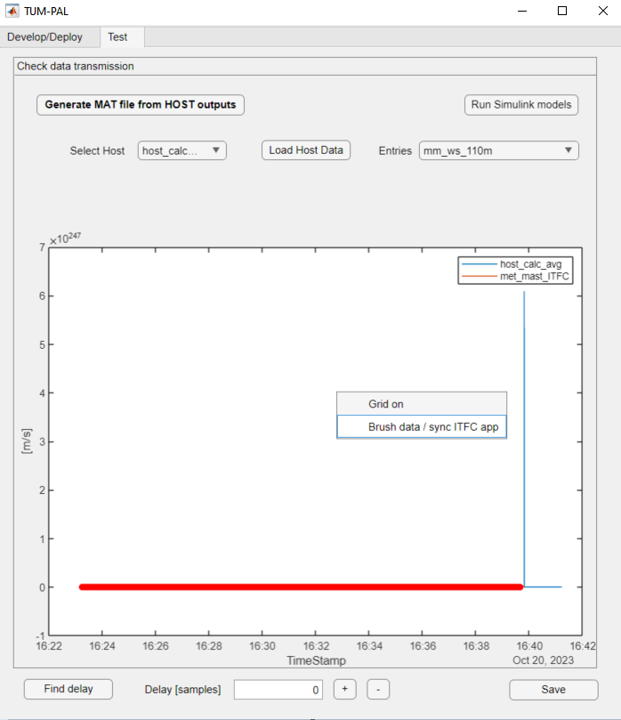

User Guide
===========

.. contents::

General Framework Architecture
------------------------------

The framework adopts a structured three-layer approach. There are named *ITFC*, *HOST*, and *SUBMODEL*. Each layer consists of specific applications, each designed to serve a distinct purpose:

**ITFC:**
*Interfaces* are the lowest-level applications responsible for tasks such as sensor reading and providing input to actuators, effectively connecting to the physical layer. Ideally, *ITFC* apps can be developed by the owner of the hardware. The use of an *ITFC* layer is only necessary when data exchange towards sensors or equipment is required. Multiple *ITFC* apps are permitted. *ITFC* applications share variables through a shared variable interface (SVI), and these can be read from and written to by a *HOST* app.

**HOST:**
This application operates in the middle layer and is responsible for tasks like data reading and writing to and from *ITFC* applications. *HOST* also manages variables crucial for experiment execution, monitoring, and communication between *SUBMODEL* applications. It generates output files in text format. Please note that as of release 1.0, each project supports only one *HOST* application. Data sharing is performed through a shared variable interface (SVI), allowing read and write access by *SUBMODEL* apps.

**SUBMODEL:**
This is the top layer, comprising the primary application models based on *Simulink* models. *Simulink* inputs and outputs are connected to *HOST* SVIs. Any number of *SUBMODELS* can be implemented within a project.

One sampling frequency must be specified for the execution of the whole framework. As of release 1.0, different frequency execution for different applications is not supported. An exemplary sketch of the framework data flow is shown in :numref:`data_flow_chart`.

Empty C source projects should be generated for each PLC application through *Bachmann SolutionCenter*. These source codes are then automatically modified by the framework to incorporate all the necessary variable interconnections required by the different applications.

The framework is equipped with a :ref:`Graphic User Interface (GUI)<user_guide_GUI>` that simplifies the development process and is divided into :ref:`Develop/Deploy<user_guide_gui_dd>` and :ref:`Test<user_guide_gui_test>`.

.. figure:: images/data_flow_chart.png
   :width: 1000
   :name: data_flow_chart

   Data flow between the different layers

.. _user_guide_project_definition:

Project Definition 
-----------------------

When a new project is initiated using the :ref:`Graphical User Interface (GUI)<user_guide_GUI>`, a folder is automatically generated with the project's name. Two additional folders, **ReferenceCFiles** and **SimulinkModels**, are created to store the reference PLC source code and necessary *Simulink* models for the *SUBMODEL* apps.

Additionally, two *Excel* files, **inputfile.xlsx** and **SVI_definition.xlsx** are created along with the folders. These files are crucial for project definition, outlining the layers of the applications architecture, and showing how data is exchanged among each application. Both these files are described in the following paragraphs.

Inputfile.xlsx
^^^^^^^^^^^^^^^^^^^^

.. include:: inputfile.inc

SVI_Definition.xlsx
^^^^^^^^^^^^^^^^^^^^

.. include:: svi_definition.inc

.. _user_guide_GUI:

Graphic User Interface
-----------------------

.. include:: gui_guide.inc

Examples
-----------------------

The following subsections describe two examples derives from wind energy applications: a met-mast data reader, which can be used to read data from from a met-mast and to perform moving averages for monitoring purposes, and a SCADA-data reader.

Example 1: Met-Mast data reader
^^^^^^^^^^^^^^^^^^^^^^^^^^^^^^^^^^

In this first example, we are going to create a simple framework to read data from a met-mast ITFC app, calculate moving averages and some additional inflow quantities, which are written back to the ITFC.

The first step is to open the framework by double-clicking on the main file "mail.mlapp". This opens the main GUI. There will be two options for us to choose: load an existing file or create a new one. We click on "new". A window will appear where we can specify the folder for our new project. We open the "Examples" folder and click OK.

Then, we need to specify the new project name. We'll call it "met_mast_reader" and click OK (:numref:`mmr_new`). This will create a set of subfolders, as explained in :ref:`Project Definition<user_guide_project_definition>`.

.. figure:: images/mmr_new.png
   :width: 1000
   :name: mmr_new

   Define new project view

We must create at least three applications, one for each data layer:

   (1) A Simulink model performing the averaging function, together with its SUBMODEL
   (2) An ITFC for data transmission and testing
   (3) An HOST, responsible for managing output data

Create a new SUBMODEL
"""""""""""""""""""""""""""

   #. Let us start by creating a Simulink model. Click on "Add SUBMODEL" and provide the name, such as "calc_avg". Click OK. This model takes inputs from wind speed and wind direction data to calculate averages based on the desired window size. A new model will appear in the relative panel's first row with several red indicator lights (:numref:`mmr_new2`).  

       .. figure:: images/mmr_new2.png
          :width: 1000
          :name: mmr_new2
    
          Overview of newly created "calc_avg"  

   #. Create an empty Simulink model by clicking "Create" in the "Create Simulink Model" column. This generates the Simulink model in the model folder and an "init_MODELTAG.m" file which can be used for initializing data and constants. A green light under "SLmodel-Ready" indicates the model's presence in the Matlab path.

   #. Next, create a new Bachman Empty project within Solution Center as detailed in the :ref:`Create Bachmann Applications <user_guide_appendix_createbachmann>` section. Ensure the main application source file is copied into the reference C folder, located in "ProjectName\\ReferenceCfiles\\Originals". If the source file name was changed, update it by clicking "Details" and altering "refC_name" to the new name (“calavg” in the present case) The green "C ref found" light indicates that the reference C file was found by the framework.

   #. Right-click on the "C ref found" light and select "Add Matlab Fields" (:numref:`mmr_new3`). This modified the reference files enabling variables interconnection.

      .. figure:: images/mmr_new3.png
         :width: 1000
         :name: mmr_new3

         Add Matlab Fields for the SUBMODEL "calc_avg" 

   #. Create the Simulink model in the appropriate folder. You can either modify the empty one, copy and paste into the existing model, or use the example provided under "Examples\\met_mast_reader_sample\\SimulinkModels\\calc_avg". If you plan to use a custom Simulink model, note that some settings may differ, so it's advisable to copy the content of your model into the newly created one. As already mentioned.

   #. Open the model provided. The model has three main inputs: 

       #.	Met mast wind speed at 110m
       #.	Met mast wind speed at 60m
       #.	Met mast wind direction at 110m. 

      The reference heights in this example are based on the IEA Task 39 reference wind turbine (INSERT REFERENCE). The model checks if variables are broken (e.g. frozen) and then calculates moving averages. Several outputs are computed:

       #.	Moving average of the wind speed at 110m
       #.	Turbulence intensity
       #.	Moving average of the wind speed at 60m
       #.	Shear exponent
       #.	Moving average of the wind direction at 110m
       #.	Status check to monitor runtime activity

   #. The model requires specific quantities defined, which you can inspect by opening the relevant “init_calc_avg.m”file. Quantities like startup time, moving average interval, and error time are here set to 600 s.
   #. With these settings in place, your Simulink model is ready to use.

Create a new ITFC
""""""""""""""""""""""""""""""""

   #. Create a new ITFC app by clicking the "Add ITFC" button and name it "met_mast_ITFC"
   #. As done for "calc_avg", create a new empty PLC code following :ref:`Create Bachmann Applications<user_guide_appendix_createbachmann>`. Name the source application "mmitfc". Copy and paste the reference app file into the "Originals" folder and update the app "Details".
   #.  Right-click on the "C ref found" light and select "Add Matlab Fields" 

Create a new HOST
""""""""""""""""""""""""""""""""

   #.  Create a new HOST app by clicking the "Add HOST" button and name it "met_mast_ITFC"
   #.  Complete all required fields using the "Details" button, following the guidance provided in the :ref:`inputfile definition <user_guide_inputfile_host>` section
   #.  Create a new empty PLC code following :ref:`Create Bachmann Applications<user_guide_appendix_createbachmann>`. Name the source  application "hcalc". Copy and paste the reference app file into the "Originals" folder and update the app "Details"
   #.  Add the necessary Matlab fields. The "PLCgen-Ready" indicator turns green. 
   #.  Specify "out_filename" field in "Details" as "hcalc_outputs" and provide the "output_path_in_PLC" (note that this may vary on your PLC). Ensure the corresponding folder is pre-created on the PLC; otherwise, the entire framework will crash on startup
   #.  At this point, the basic applications have been created. Don't forget to save your progress by clicking the “Save” button below. This will write the excel file “inputfile.xlsx”

Modify the "inputfile.xlsx"
""""""""""""""""""""""""""""""""

Open the "inputfile.xlsx". Any changes made to the “Submodels”, “ITFC” and “HOST” tabs will be reflected in the application the next time it's loaded.

Click on the "Settings" tab, and adjust the parameter "sample_time" to the desired value. In this case 0.1 seconds is chosen. All framework applications will run at this frequency. As already mentioned, only Bachmann systems can be selected in the "PLC_system" column.

Next, navigate to the "Submodels" tab. In the "host_apptag" column of "calc_avg", specify "host_calc_avg". This indicates the host application which the submodel application exchanges data with. As already said, only one host application should be used for every SUBMODEL. Save and close the file.

Below an overview of the different tabs in "inputfile.xlsx"

.. csv-table::  met_mast_reader - "inputfile.xlsx" - SUBMODEL
   :file: inputfile_met_mast_reader_1.csv
   :header-rows: 1

.. csv-table::  met_mast_reader - "inputfile.xlsx" - ITFC
   :file: inputfile_met_mast_reader_2.csv
   :header-rows: 1

.. csv-table::  met_mast_reader - "inputfile.xlsx" - HOST
   :file: inputfile_met_mast_reader_3.csv
   :header-rows: 1

.. csv-table::  met_mast_reader - "inputfile.xlsx" - Settings
   :file: inputfile_met_mast_reader_4.csv
   :widths: 30, 60, 10
   :header-rows: 1

Modify the “SVI_Definition”
""""""""""""""""""""""""""""""""

In this step we will define the variables for each application and the relative variable interconnections between different layers. Open the "SVI definition.xlsx." The definitions relative to each layer is specified in the following sections.

**ITFC**

We want now to create a dummy interface to emulate real-world conditions. For the present met-mast case, we want to define two variables: one is a structure which will contain the met-mast variables to be read by the HOST "host_calc_avg". The second is a vector of double, which contains all variables that the HOST will write back to the ITFC. 

   #. Create the structure: set both "TagName" and "VarName" as "met_mast". Set 'InputNumber' to 1 and verify that "AppName" matches the HOST app in "inputfile.xlsx." Specify "VarType" as "struct," type "READ" in the "Access" field, and ensure "Create" is set to true. It's worth reminding that structures can handle variables of different data types. The "VarSize" field is used to specify the size in bytes of the structure's content, which may vary based on the data types included. For now, it can be left empty

   #. Define three subvariables under "met_mast." These subvariables are: 
       #. Wind Speed at 110 Meters, named "ws_110m"
       #. Wind Speed at 60 Meters, named "ws_60m"
       #. Wind Direction at 110 Meters, named "wd_110m"
      
      Ensure that the "InputNumber" for each subvariable matches that of the structure, leave "AppName" empty, specify "VarType" as "double," set "VarSize" to 1, and mark "Create" as true for each of these subvariables. "Access" can be left empty, since it will be inherited from the structure
   #. Create a variable named "exchange_data_mm" for the purpose of storing and writing output values from the HOST to the ITFC. "InputNumber" must be 2, set "VarType" to double and "VarSize" to 5. Set "Access" to WRITE

The resulting sheet can be viewed in the following :ref:`table<SVI_Definition_itfc_mmreader>`.

.. csv-table::  met_mast_reader - "SVI_Definition.xlsx" - ITFC
   :file: SVI_Definition_itfc_mmreader.csv
   :header-rows: 1
   :name: SVI_Definition_itfc_mmreader

**HOST**

The "host_calc_avg" app contains 10 variables, as shown in the :ref:`table<SVI_Definition_itfc_mmreader>`: 

   #. Create three variables that correspond to the inputs of your Simulink model. These variables must be read from the interface structure, therefore "parent_App," "parent_TagName,      " and "parent_SubVar" must be defined. Set "Action" to "READ" and set the "output_freq" as "fast" for these input variables.
   #. Specify the outputs of our Simulink model, which consist of six variables. Out of these six variables, five are exchanged with the interface, so we must provide information in       the "parent_App," "parent_TagName," and "parent_SubVar" fields for these. The last variable, "avg_inflow State," will not be written back to the interface. For the averaged       quantities, we define "output_freq" as "slow", while for the “avg_inflowState”, we print it at “ctrl” frequency.
   #. It is mandatory to include an “AppStatus” variable for each submodel included in the framework. Since here we have a single submodel named “calc_avg”, the variable       “avg_inflow_AppStatus” is added. the type of this quantity can be a 16 bit unsigned integer. This variable is outputted at “ctrl” frequency.

.. csv-table::  met_mast_reader - "SVI_Definition.xlsx" - HOST
   :file: SVI_Definition_host_mmreader.csv
   :header-rows: 1
   :name: SVI_Definition_host_mmreader

**Submodels**

 The SUBMODEL "calc_avg" must be defined, according to the input port of the underlying Simulink model and its application status.
 
 #. Define three variables, which are the inputs of the Simulink model. Set "IO" as "input". The fields "parent_App" and "parent_TagName" must be specified. Ensure that the "Action"     is set as "READ”.
 #. Define six variables that represent the outputs of the Simulink model. Set "IO" as "output". The fields "parent_App" and "parent_TagName" must be specified. Ensure that the     "Action" is set as "WRITE.
 #. It's crucial to correctly define the “PortNumber” of both inputs and outputs variables correctly based on the port numbering of the Simulink model. Also the “PortName” should     match those in the Simulink model.
 #. Create an "AppStatus" variable, indicated by the "IO" field set as "status." This variable doesn't require a port number, and the port name should be set as "AppStatus." Set this     variable to "write."
 
 Save and close the “SVI_Definition” file.
 
 .. csv-table::  met_mast_reader - "SVI_Definition.xlsx" - SUBMODELS
    :file: SVI_Definition_sm_mmreader.csv
    :header-rows: 1
    :name: SVI_Definition_sm_mmreader

Generate the test interface
""""""""""""""""""""""""""""""""

After modifying the "SVI_Definition.xlsx", the project needs to be reloaded. An error will now happen, saying::

    ITFC App "met_mast_ITFC" - variable "met_mast" is a struct of size NaN Bytes, but its subvariables sum up to 24. Please check the excel file.

This is caused by the fact that we left empty the “VarSize” field of the ITFC variable “met_mast”. We can therefore insert 24 in the field (3 doubles of 8 bytes each).

It is now time to create a dummy interface:

    #. Open your the details of the ITFC app "met_mast_ITFC" and fill in the "test_ITFC_filename" for your ITFC app, including any relative path. Let's create this file in "./Examples/met_mast_reader/mm_ITFC.mat"

    #. Click now on the button "Create Random ITFC." This action will prompt you to specify the duration of the time histories. The default value is 100 seconds. Keep in mind that if it's too long, it might pose storage issues on your PLC. However, in this case, since we have only a few variables, it shouldn't be a problem. Let's set it to 1000 seconds and click "OK."

    #. You'll notice that a new "mm_ITFC.mat" file has been generated. If you open it, you'll find the "met_mast" structure and the "exchange_data_mm" array. Initially, these variables will be populated with random data according to their data type. However, this will not be realistic for wind speed and direction data. You have two options: either replace the random data with your own or use the provided dummy variables containing realistic data. By default, only the read variables will be filled with random numbers, while the others will be set to 0.
    
    #. Open the details of your ITFC_App and set its "Flag_Create_test_ITFC" to TRUE. Click on "Load ITFC".

Generate the PLC code
""""""""""""""""""""""""""""""""

To generate the PLC code, make sure all "Generate PLC" checkboxes are ticked, save your project and then click on the "Generate PLC" button at the bottom of the GUI.

Consequently, three folders will be created under the directory labeled "PLCApps." To conclude this process, you should transfer the contents of each of these folders into the corresponding applications folder within your PLC path.

Testing the framework
""""""""""""""""""""""""""""""""

The applications can be now run through the Bachmann Solution Center. It is important to run the different applications in a specific order: start with the ITFC, proceed to HOST, and conclude with the submodel.

Within the HOST applications, a variable called "Flag_Record" is created. You can use it to control the generation of output files.
Wait for the test to complete, which will take 1000 seconds. Once it's done, copy the output files back to the Matlab folder.

In the GUI "Test" tab, generate a ".mat" file that aggregates your outputs by clicking "Generate MAT file from HOST outputs." Select all the outputs (FAST, SLOW, and CTRL). This will create a file named "hcalc_outputs.mat."
Choose the HOST "host_calc_avg" and load its data through the "Load Host data", using the ".mat" file you just created. All the host variables will be visible in the dropdown menu.

Select a variable, such as "mm_ws_110m." You will see two curves, one from the ITFC data and the other from the output of the HOST application. Through this step we can verify whether the two signals are identical.
If discrepancies are observed in the HOST data, it may indicate data transmission errors. In the present case, we will see something like this:

   Data trasmission error: excessive recording time

We can see that the "host_calc_avg" time history goes to unrealistic values after the end of the "met_mast_ITFC". This is due to the fact that, after the 1000 s embedded in the ITFC application, random values where trasmitted to the HOST application. This portion of data is not representative of real data trasmission and should be trimmed.

To do that, use the "Brush Data" feature to select the data you wish to retain. Right-click, and choose "Brush Data / Sync ITFC App".

   Data brushing to trim time history endings

The signals might still have a time shift because the ITFC application began earlier than the HOST application.

   Data brushing to trim time history endings

To correct this time shift, click "Find delay" and manually adjust the ITFC signal using the "+” and “-” buttons. Once synchronization is achieved, select the data to keep and employ the "Brush Data / Sync ITFC App" function once more. This function will synchronize all variables originating from the same ITFC application, eliminating the need to do it individually for each HOST variables. Therefore, also the variables “mm_ws_60m” and “mm_wd_110m” will be syncronized. At this point we should check whether the data are perfectly coincident of there still are some transmission errors, which may be a sign of incorrect setup of the "SVI_Definition.xlsx" or some PLC errors. 

   Syncronized data

When we choose "avg_ws_110m," (or any variable which should be an output of a Simulink model) we notice that we can only see the "host_calc_avg" results. We would like to confirm that the Simulink model work the same way in both the PLC and Matlab. To do this, we run the Simulink model by clicking "Run Simulink models," which uses the same inputs as the host application. This helps us compare and make sure the C model is working correctly. Simulink outputs will display as well.

   PLC vs Simulink time histories for the entry "avg_ws_60m"

The comparison should align well after the initial ramp-up time required for the moving average.
Verify the last two variables, "avg_inflow_AppStatus," which should be 0 when the submodel "calc_avg" was not running and 1 otherwise, and "avg_inflowState," which should be 0 when the submodel is running correctly and a number between 1 and 7 otherwise.
Save your results by clicking on "Save" with the desired output file name to generate a ".mat" file for future reference.
This concludes the present tutorial. Your applications are now ready for execution.

Example 2: SCADA data reader
^^^^^^^^^^^^^^^^^^^^^^^^^^^^^^^^^^

The present tutorial aims at developing a SCADA data reader for wind energy applications. As a prerequisite, the user is reccommended to have follower the tutorial "Met-Mast data reader", since this tutorial will focus mostly on the differences with respect to the previous case.

Create a new project, and name it "SCADA_reader".

In this tutorial,several applications will be created:

    #. 3 SUBMODELS, connected to Simulink models performing inflow averagine, wind farm monitoring, and loads postprocessing
    #. 3 ITFC, which simulate data provided by different clients
    #. An HOST, responsible for managing output data

Create SUBMODEL apps
"""""""""""""""""""""""""""

The procedure to create new SUBMODELS is the same described in the previous example (INSERT LINK). SUBMODELS naming goes as follows:

    #. Create three submodels, named "avg_inflow", "WF_status", "loads_process".
    #. Create empty Simulink models for the three SUBMODELS
    #. Create new Bachmann C projects and name them "avginflw", "wfstatus", "loadsprc". Copy into the reference C folder. Update the names it by clicking “Details” and changing “refC_name”
    #. Right-click on the “C ref found” light and select “Add Matlab Fields”
    #. Create the Simulink models. For simplicify, use the models provided under "Examples\\SCADA_reader_sample"
    #. If you inspect the Simulink models provided, you will notice that "avg_inflow" is equivalent to "avg_calc" of the previous example. "WF_status" simply check whether a turbine is producing power and whether the wind direction is within a specific range. "loads_process" calculates out-of-plane and in-plane blade root bending moments from flapwise and edgewise moments.

Create ITFC apps
"""""""""""""""""""""""""""

#. Create three ITFC apps, named "itfc_scada", "itfc_mm" and "itfc_loads".
#.  As already done for the SUBMODEL apps, create empty PLC code and paste the reference source codes. Name them "ifcscada", "ifcmm", "ifcloads"
#.   Update "Details" reference C codes.
#.   Right-click on the "C ref found" light and select "Add Matlab Fields"

Create HOST apps
"""""""""""""""""""""""""""
#. Create one HOST apps, named "host_scada"
#. As already done for the SUBMODEL apps, create empty PLC code and paste the reference source codes. Name it "hstscada"
#.   Update "Details" reference C codes.
#.   Right-click on the "C ref found" light and select "Add Matlab Fields"
#.  Specify “out_filename” field in “Details” as "host_scada" and provide the "output_path_in_PLC" (note that this may vary on your PLC). Ensure the corresponding folder is pre-created on the PLC; otherwise, the entire framework will crash on startup
#.  Save

Modify the "inputfile.xlsx"
""""""""""""""""""""""""""""""""

The steps to modify the "inputfile.xlsx" are the same described in (SECTION XX). The different tabs are reported below, for completeness.

.. csv-table::  SCADA_reader - "inputfile.xlsx" - SUBMODEL
   :file: inputfile_scadap1_sm.csv
   :header-rows: 1

.. csv-table::  SCADA_reader - "inputfile.xlsx" - ITFC
   :file: inputfile_scadap1_itfc.csv
   :header-rows: 1

.. csv-table::  SCADA_reader - "inputfile.xlsx" - HOST
   :file: inputfile_scadap1_host.csv
   :header-rows: 1

.. csv-table::  SCADA_reader - "inputfile.xlsx" - Settings
   :file: inputfile_scadap1_settings.csv
   :widths: 30, 60, 10
   :header-rows: 1

Modify the “SVI_Definition”
""""""""""""""""""""""""""""""""

Unlike the "met_mast_reader", a more complex variable mapping is necessary for the "SCADA_reader". Each layer is detailed with a dedicated section.

**ITFC**

The test ITFC applications are here designed to simulate a realistic case in which data is coming from different hardware and applications, and operating in a three wind turbines wind farm. For each ITFC application, the following variables are included:

#. itfc_scada contains 6 variables. SCADA data is provided through a structure variable, one for each turbine. Each structure includes subfields related to different quantities such as rotorspeed, pitch, power, and so on. In addition, vibrations are measured as well for each turbine and in the three directions, through double arrays
#. itfc_mm contains 1 structure. This ITFC app replicates "met_mast_ITFC" of the "met_mast_reader"
#. itfc_loads contains 1 structure, which provide data in terms of blade loads for the three wind turbines
#. two additional WRITE variables are included within the ITFC app "itfc_scada". The first is a 10-element double array used for control purposes. The second is a structure in which the in-plane and out-of-plane bending loads are written by the HOST

An overview of the ITFC variables is shown below

.. csv-table::  SCADA_reader - "SVI_Definition.xlsx" - ITFC
   :file: SVI_Definition_scada_itfc.csv
   :header-rows: 1

**HOST**

The following table presents the list of the HOST variables implemented in the "SVI_Definition.xlsx". It is possible to notice that the variables fed to "exchange_data_ctrl" has been assigned an initial value equal to 1. Beside the greater number of variables, there is not many differences with respect to the "met_mast_reader". 

.. csv-table::  SCADA_reader - "SVI_Definition.xlsx" - HOST
   :file: SVI_Definition_scada_host.csv
   :header-rows: 1

**SUBMODEL**

Similarly, an overview of the SUBMODELS variables is provided below.

.. csv-table::  SCADA_reader - "SVI_Definition.xlsx" - SUBMODEL
   :file: SVI_Definition_scada_sm.csv
   :header-rows: 1

Generate the test interface
""""""""""""""""""""""""""""""""
After modifying the “SVI_Definition.xlsx”, the project needs to be reloaded. Similarly to the "met_mast_reader", the correct size will need to be provided for the structure variables.

    #. Dummy interfaces need to be generated for the different ITFC applications. Define the "test_ITFC_filename" fields for each ITFC app, named:
        #. ./Examples/SCADA_reader/itfc_scada.mat
        #. ./Examples/SCADA_reader/itfc_mm.mat
        #. ./Examples/SCADA_reader/itfc_loads.mat
    #. Click on "Create Random ITFC"
    #. You will notice that new .mat files are generated for the three ITFC applications. Again, this will not contain realistic data. You have two options: either replace the random data with your own or use the provided dummy variables containing realistic data. By default, only the read variables will be filled with random numbers, while the others will be set to 0.
    #. Open the details of the ITFC apps and set their “Flag_Create_test_ITFC” to TRUE. Click on “Load ITFC”.

Generate the PLC code
""""""""""""""""""""""""""""""""

Save as (SECTION XX)

Testing the framework
""""""""""""""""""""""""""""""""

The testing of the project follows very closely what was done for the "met_mast_reader". A few remarks:
    #. The syncronization must be performed on all three ITFC applications
    #. SUBMODELS will be run at "FAST" frequency, which may differ from the HOST variables

Appendix
-----------------------

.. include:: appendix.inc

.. include:: types.inc